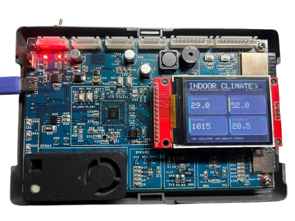
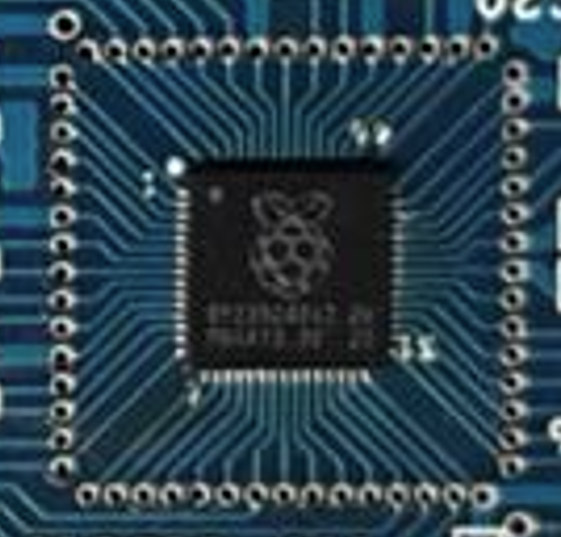

# RP2350 AI Environmental Kit

## Overview

The RP2350 AI Environmental Kit is an edge computing platform designed for environmental sensing, TinyML experimentation, and IoT prototyping. The board is built around the Raspberry Pi RP2350 microcontroller and integrates a range of environmental, acoustic, and air-quality sensors along with wireless connectivity and data logging capabilities.

The goal of the platform is to provide a complete hardware base for building intelligent sensing systems capable of local data processing, machine learning inference, and cloud connectivity.

Typical use cases include:

* Environmental monitoring
* Air quality monitoring
* TinyML experiments
* IoT sensor nodes
* Edge AI research

---

# System Architecture

The system is organized into several major functional blocks:

* RP2350 Processing Core
* ESP32 Connectivity Co-Processor
* Environmental Sensor Subsystem
* Data Logging and Peripherals

This modular architecture makes the platform suitable for both firmware development and hardware experimentation.

---

# Core Microcontroller

## RP2350A

The main processor is the Raspberry Pi RP2350 microcontroller.

Key features:

* Dual-core ARM Cortex-M33
* DSP instruction support
* Floating point unit (FPU)
* Hardware security support
* High-speed GPIO and peripherals
* Suitable for TinyML and DSP workloads

External flash memory is used for program storage and data.

### External Flash

The board uses a W25Q128 SPI flash memory.

* 128 Mbit storage
* Connected through QSPI
* Used for firmware and model storage

---

# Connectivity Processor

## ESP32-WROOM-32E

The board integrates an ESP32 module that acts as a wireless connectivity co-processor.

Features:

* WiFi connectivity
* TCP/IP networking
* UART communication with RP2350
* Remote firmware communication

Typical workflow:

Sensors -> RP2350 -> Local Processing -> ESP32 -> Cloud

This separation allows deterministic sensor processing on the RP2350 while the ESP32 handles networking tasks.

---

# Sensor Subsystem

The board integrates several sensors for environmental monitoring and machine learning applications.

## BME680 Environmental Sensor

Measures:

* Temperature
* Humidity
* Barometric pressure
* Gas resistance

Useful for indoor environmental monitoring and air quality estimation.

## ENS160 Air Quality Sensor

Provides advanced air quality measurements:

* VOC index
* Air quality index
* Equivalent CO2 estimation

## VEML6030 Ambient Light Sensor

Used for precise illumination measurement.

Applications include:

* Smart lighting
* Environmental sensing

 
---

# Timekeeping

## DS1338 Real Time Clock

Provides accurate timekeeping with battery backup.

Used for:

* Timestamping sensor data
* Scheduled measurements
* Long-term data logging

---

# Power System

The board supports both USB and battery powered operation.

## USB Power

USB-C connector provides system power and programming interface.

## Battery Support

The board supports LiPo battery operation.

### Power Monitoring

INA219 current sensor enables monitoring of:

* Current consumption
* Voltage
* Power usage

This is useful for low-power optimization.

---

# Data Logging

## MicroSD Card

The board includes a microSD card slot for:

* Sensor data logging
* Dataset collection
* TinyML training data

---

# I2C Expansion

## TCA9548A I2C Multiplexer

Allows multiple I2C buses.

Advantages:

* Avoids address conflicts
* Improves bus reliability
* Enables additional sensors

---

# Display Support

SPI display connector supports external displays:

* 2.4" TFT display

Possible uses:

* Data visualization
* Debug information
* Local UI

---

# Additional Features

* GPIO expansion headers
* Status LEDs
* USB boot mode
* Reset and control buttons

---

# Applications

The platform can be used for a wide range of projects:

Environmental monitoring stations

Air quality monitoring systems

Smart building sensors

Edge AI sensing nodes

Industrial condition monitoring

TinyML experimentation

---

# Development

The board can be programmed using:

* Raspberry Pi Pico SDK
* Arduino framework
* MicroPython

Machine learning models can be deployed using:

* TensorFlow Lite Micro
* Edge Impulse

---

# Future Improvements

Possible improvements for future revisions:

* Additional environmental sensors
* LoRa connectivity
* Low-power optimization

---

# License

Open hardware project.

Schematics and firmware can be shared under an open source license depending on project requirements.

---

# Author

Abin Antony

R&D Engineer

VI Microsystems Pvt Ltd
